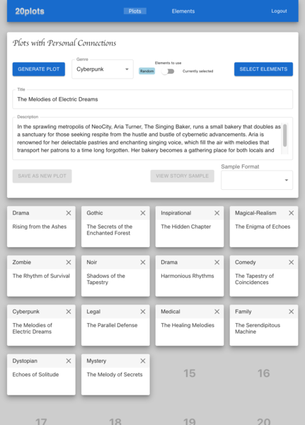

# 20plots

## Overview
**20plots** is an open-source web application designed to help users generate and manage creative writing plots based on personal elements. It combines artificial intelligence with user input to inspire and assist in the creative process. The application is built using a Java backend with Spring Boot and a React frontend, deployed on AWS with infrastructure managed via Terraform.

  

### Project Status
**20plots** is provided as-is, primarily for reference and inspiration. It was successfully deployed and operational at the time of its creation but is no longer under active development or maintenance.  

This project is not supported, and no guarantees are made about its functionality, security, or compatibility with future technologies. Contributions are welcome but will be reviewed at my discretion, and new features or enhancements are unlikely to be accepted.  

### Features
- **Personalized Plot Generation:** Use AI to generate story plots tailored to your unique interests and experiences.
- **Interactive Plot Management:** Curate and manage your top 20 story plots, create new versions, or manually add your own ideas.
- **Creative Pool Builder:** Develop lists of interesting people, personal anecdotes, story concepts, locations, and dreams to fuel your creativity.
- **Genre Selection:** Choose from 44 different genres to match your mood and writing style.
- **Format Preview:** Preview your stories in 15 different formats, such as screenplay, prose, or monologue, to see how your ideas come to life.
- **Sample Scripts:** Get inspired by sample scripts generated from your plots to spark your imagination.

**AI-assist, not AI-replace:** 20plots is designed to assist and inspire human creativity, not to replace it.

## Walkthrough

Explore a detailed walkthrough of 20plots, complete with screenshots, features, and functionality:
➡️ **[20plots Walkthrough](docs/walkthrough.md)**

## Table of Contents
- [Prerequisites](#prerequisites)
- [Getting Started](#getting-started)
  - [Setting Up Environment Variables](#setting-up-environment-variables)
  - [Cloud Configuration](#cloud-configuration)
  - [Server-Side Application](#server-side-application)
  - [Client-Side UI](#client-side-ui)
- [Scripts](#scripts)
  - [Deployment Scripts](#deployment-scripts)
  - [Development Scripts](#development-scripts)
- [Usage](#usage)
- [Notes](#notes)
- [Contributing](#contributing)

## Prerequisites
To set up and run 20plots, ensure you have the following installed:

- **Java Development Kit (JDK) 17** or later
- **Node.js** and **npm**
- **Terraform**
- **Docker** (optional, for containerized deployment)
- **PostgreSQL** database
- **AWS CLI** (optional, for deploying to AWS ECR)

## Getting Started

### Setting Up Environment Variables

20plots uses environment variables for configuration. You can set these in your shell or by creating a `.env` file in the project's root directory.

#### Required Environment Variables

**General Configuration:**

- `TWENTYPLOTS_POSTGRES_URL`: PostgreSQL JDBC URL (e.g., `jdbc:postgresql://localhost:5432/twentyplots`).
- `TWENTYPLOTS_POSTGRES_USERNAME`: PostgreSQL username.
- `TWENTYPLOTS_POSTGRES_PASSWORD`: PostgreSQL password.
- `TWENTYPLOTS_JWT_SECRET`: JWT secret key.
- `TWENTYPLOTS_FRONTEND_URL`: Frontend URL (e.g., `http://localhost:3000`).
- `TWENTYPLOTS_OPENROUTER_APIKEY`: OpenRouter API Key.
- `TWENTYPLOTS_OPENAI_APIKEY`: OpenAI API Key.
- `TWENTYPLOTS_OPENAI_MODEL`: OpenAI Model (e.g., `text-davinci-003`).

**Deployment Configuration (for AWS ECR):**

- `AWS_ACCOUNT_ID`: Your AWS account ID.
- `AWS_REGION`: AWS region (default: `us-east-2`).
- `ECR_REPOSITORY`: ECR repository name.
- `DOCKER_IMAGE_TAG`: Docker image tag (default: `latest`).
- `PLATFORM`: Build platform (default: `linux/amd64`).
- `ACTIVE_PROFILE`: Spring Boot active profile (`dev` or `prod`, default: `prod`).

#### Example `.env` File

Create a `.env` file in the root directory:

```
# General Configuration
TWENTYPLOTS_POSTGRES_URL=jdbc:postgresql://localhost:5432/twentyplots
TWENTYPLOTS_POSTGRES_USERNAME=your_db_username
TWENTYPLOTS_POSTGRES_PASSWORD=your_db_password
TWENTYPLOTS_JWT_SECRET=your_jwt_secret
TWENTYPLOTS_FRONTEND_URL=http://localhost:3000
TWENTYPLOTS_OPENROUTER_APIKEY=your_openrouter_apikey
TWENTYPLOTS_OPENAI_APIKEY=your_openai_apikey
TWENTYPLOTS_OPENAI_MODEL=gpt-4o-2024-11-20

# Deployment Configuration
AWS_ACCOUNT_ID=your_aws_account_id
AWS_REGION=us-east-2
ECR_REPOSITORY=twentyplots
DOCKER_IMAGE_TAG=latest
PLATFORM=linux/amd64
ACTIVE_PROFILE=prod
```

**Note:** Do not commit your `.env` file to version control as it contains sensitive information.

#### Loading Environment Variables

Load the variables into your shell session:

```
export $(grep -v '^#' .env | xargs)
```

### Cloud Configuration

The cloud infrastructure is managed using Terraform.

#### Applying the Terraform Configuration

1. **Navigate to the cloud directory:**

   ```
   cd 20plots-cloud/
   ```

2. **Initialize Terraform:**

   ```
   terraform init
   ```

3. **Apply the configuration:**

   ```
   terraform apply
   ```

   Terraform will prompt for variable values if not provided in a `terraform.tfvars` file or environment variables.

### Server-Side Application

The server application is a Spring Boot project using OpenJDK 17.

#### Setup Instructions

To run the server locally, you can use the provided script `dev-run-server.sh`.

1. **Ensure that the frontend URL is set correctly:**

   The `dev-run-server.sh` script sets `TWENTYPLOTS_FRONTEND_URL` to `http://localhost:3000` before running the server.

2. **Run the development server script:**

   ```
   ./scripts/dev-run-server.sh
   ```

   This script will:

   - Stop and remove any existing Docker container named `20plots-server-container`.
   - Clean and build the project using Gradle.
   - Start the server application with the appropriate environment variables.

### Client-Side UI

The client UI is a React application.

#### Setup Instructions

To run the client locally, use the provided script `dev-run-ui.sh`.

1. **Run the development UI script:**

   ```
   ./scripts/dev-run-ui.sh
   ```

   This script will:

   - Stop and remove any existing Docker container named `20plots-ui-container`.
   - Create an `.env` file with `REACT_APP_BACKEND_URL` set to `http://localhost:8080`.
   - Build the React application.
   - Start the development server.

## Scripts

The `scripts` directory contains scripts for deploying and running the applications.

### Deployment Scripts

- **`deploy-server.sh`**: Builds and pushes the server Docker image to a container registry.
- **`deploy-ui.sh`**: Builds and pushes the UI Docker image to a container registry.

#### Configuring Deployment Scripts

These scripts use environment variables for configuration. Ensure the following variables are set:

- `AWS_ACCOUNT_ID`
- `AWS_REGION`
- `ECR_REPOSITORY`
- `DOCKER_IMAGE_TAG`
- `PLATFORM`
- `ACTIVE_PROFILE`

#### Running Deployment Scripts

1. **Set environment variables:**

   ```
   export AWS_ACCOUNT_ID=your_aws_account_id
   export AWS_REGION=us-east-2
   export ECR_REPOSITORY=your_ecr_repository_name
   export DOCKER_IMAGE_TAG=latest
   export ACTIVE_PROFILE=prod
   ```

2. **Deploy the server:**

   ```
   ./scripts/deploy-server.sh
   ```

3. **Deploy the UI:**

   ```
   ./scripts/deploy-ui.sh
   ```

### Development Scripts

- **`dev-run-server.sh`**: Runs the server in development mode.
- **`dev-run-ui.sh`**: Runs the UI in development mode.

These scripts simplify running the applications in a development environment without containerization.

### Other Scripts

- **`init_psql.sh`**: Initializes the PostgreSQL database.
- **`regkey.py`**: Generates registration keys.
- **`run-server.sh`**: Starts the server application.
- **`run-ui.sh`**: Starts the client UI.
- **`stop-server.sh`**: Stops the server application.
- **`stop-ui.sh`**: Stops the client UI.

## Usage

Once both the server and client are running, access the application at: http://localhost:3000

## Admin Panel

### Overview

The **Admin Panel** provides administrative functionalities such as:

- Executing ad-hoc database queries.
- Sending custom AI queries to advanced GPT models.

These features are useful for database management and accessing the LLM via the API.

### Configuring the Admin Credentials

#### Prod Mode

For prod mode, configure these secrets in the AWS secrets manager:
- twentyplots.admin.username
- twentyplots.admin.password
- twentyplots.admin.email

#### Dev Mode

To access the Admin Panel in dev mode, you need to configure the admin username in the application source code before building it.

1. **Edit the `AdminService` Class**

   Open `AdminService.java` located at:
   ```
   20plots-server/src/main/java/com/sneakyghost/twentyplots/services/AdminService.java
   ```

2. **Replace the Placeholder Username**

- Locate the fetchSecretAdminName() method.
- Replace "your-admin-username" with your desired admin username.

### Accessing the Admin Panel
Log in using the admin username you configured.
You will see additional navigation options for the Admin Panel:

- Admin AI Page: Send custom prompts to AI models.
- Admin DB Page: Execute SQL queries directly against the database.

Note: Use these features with caution, as they can affect your database and application behavior.

## Notes

- **Docker System Prune:** The deployment scripts run `docker system prune -a -f`, which removes all unused containers, networks, images, and optionally, volumes. **Use with caution**, as this will delete all dangling resources. You may comment out or remove this line if unnecessary.

- **AWS ECR Authentication:** The deployment scripts use AWS CLI for authentication. Ensure you have the AWS CLI installed and configured with the necessary permissions.

- **Platform Compatibility:** Scripts are written for Unix-like systems.

- **External Configuration:** For production environments, consider using externalized configuration files or environment variables instead of modifying application properties within the scripts.

## Contributing

**Note:** This project is not under active development. I may review and accept pull requests for critical bug fixes, security issues, or particularly valuable improvements, but I'm not actively adding new features or committing to regular maintenance.

If you still wish to contribute:

1. **Fork** the repository.
2. **Create a new branch** for your feature or bug fix:
```bash
git checkout -b feature/your-feature-name
```
3. **Commit your changes** with clear messages.
4. **Push to your fork:**
```bash
git push origin feature/your-feature-name
```
5. **Submit a pull request** detailing your changes.

I appreciate any contributions that address serious bugs or improve stability/security. Please understand that response times and acceptance of non-critical contributions may be limited.
