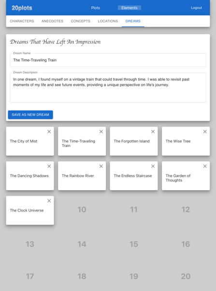
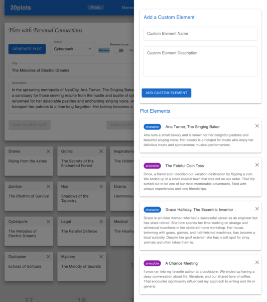
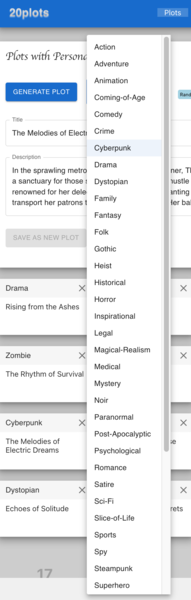
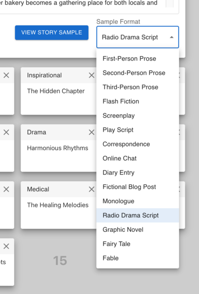
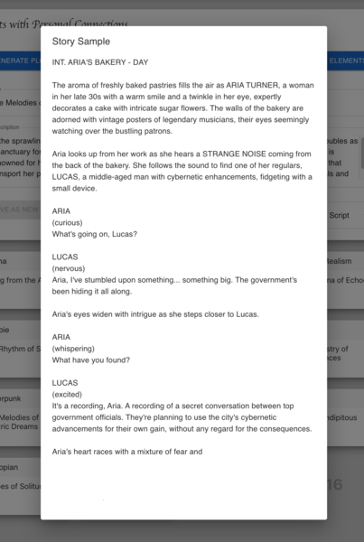

# Walkthrough: 20plots

## Unleash Your Creativity with 20plots

A brainstorming tool that suggests story plots with personal connections — **AI-assist, not AI-replace!**

---

## Story Plots
  
Develop a collection of story plots that combine your personal elements. You can create new versions of existing plots or manually create your own. Curate your ideas because you can only keep your top 20!

---

## Creative Pool Builder
  
Build lists (up to 20 each) of interesting people, personal anecdotes, story concepts, locations, and dreams. 20plots will use this creative pool to generate unique story plots for you.

---

## Plot Elements
  
View the elements used to generate a plot. Tweak the list to generate new plots. Your imagination is the limit!

---

## Genre Selection
  
Choose from a wide variety of **44 genres** for your story plots. From fantasy to thriller, select a genre you're in the mood for.

---

## Format Preview
  
Preview your story in **15 different formats.** Whether you're writing a screenplay, prose, or a monologue, get a glimpse of how your story comes alive.

---

## Sample Scripts
  
Get a sneak peek of how your story might play out with generated sample scripts. Perfect for sparking ideas and letting the creativity flow.
